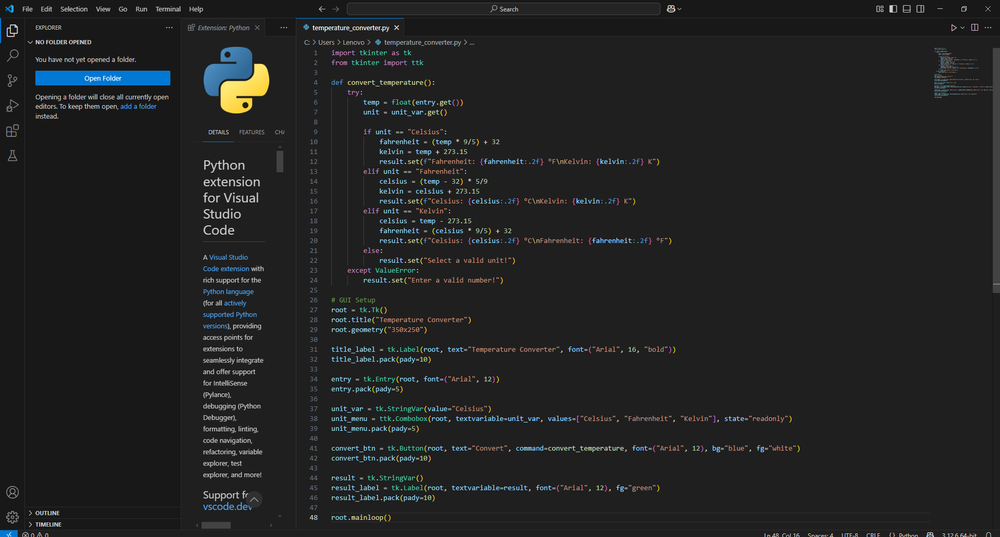
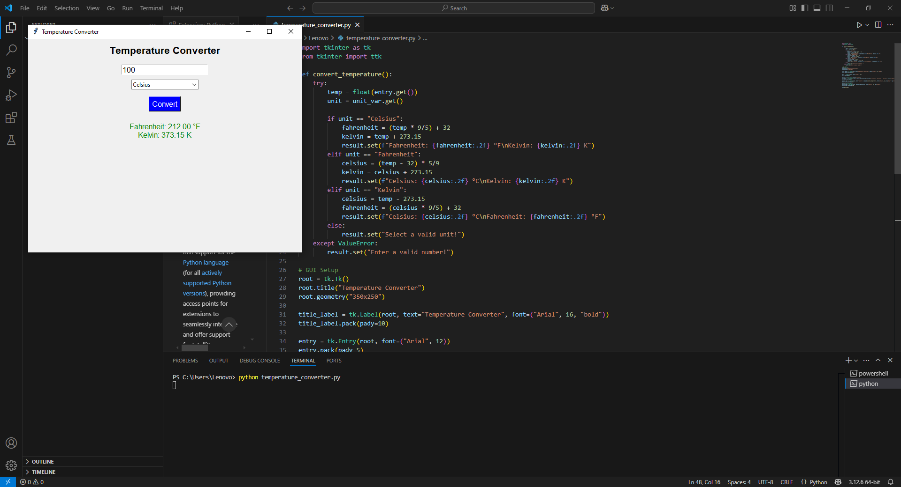

# 🌡️ Temperature Converter - Python GUI

*Task 01 - Prodigy InfoTech Internship (Software Development)*  
Created by *Riya*

This is a simple GUI-based temperature converter application built using Python and Tkinter.  
It allows users to convert temperatures between *Celsius, **Fahrenheit, and **Kelvin*.

---

## 📌 Project Description

This project was built as part of my internship at Prodigy InfoTech.  
The goal was to create a user-friendly interface that:
- Accepts a temperature value
- Lets the user select the input unit
- Converts and displays the temperature in two other units

---

## 🚀 How to Run

### Requirements:
- Python 3 installed

### Steps:
bash
python temperature_converter.py

## 📸 Screenshots

### 1️⃣ Code Interface
This shows the main Python script (temperature_converter.py) opened in VS Code.

### 2️⃣ User Input + Output Example
Here, the user inputs a temperature and gets the converted result.

### 3️⃣ Error Handling
Demonstrates the program handling invalid input (like alphabets) with an error message.

